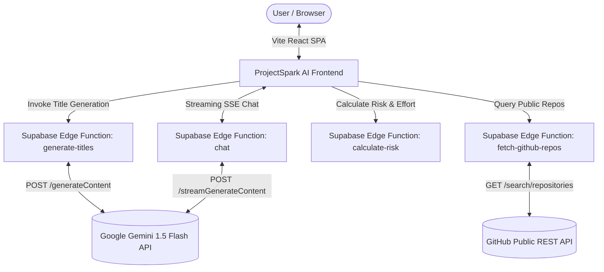

# ⚡ ProjectSpark AI

<div align="center">


<p align="center">
  <strong>Intelligent Software Engineering & Academic Capstone Project Title Recommender</strong><br />
  Powered by Google Gemini 1.5 Flash • Real-time GitHub Public Repo Uniqueness Analysis • Risk Assessment & SDLC Advisor
</p>

[Live Demo](https://projectspark-ai.vercel.app) • [Key Features](#-key-features) • [Architecture](#-architecture) • [Getting Started](#-getting-started) • [Deployment](#-deployment-guide)

</div>

---

## 📖 Overview

**ProjectSpark AI** is an intelligent assistant engineered for software engineering students, educators, and developers. Brainstorming a final-year or semester capstone project is fraught with repetitive ideas and outdated concepts. 

ProjectSpark AI solves this by:
1. **Generating Academic-Grade Project Titles & Descriptions** customized to your domain, team size, timeline, and tech stack.
2. **Identifying the Core Real-World Problem Solved** so projects deliver tangible business and social value rather than being toy clones.
3. **Calculating a Live GitHub Uniqueness Score (0–100%)** by cross-referencing public repositories using the GitHub REST API, highlighting similar open-source projects with stars and direct links.
4. **Providing an SEPM Risk Assessment & SDLC Advisor** that estimates effort in weeks, flags complexity risks, and recommends optimal development methodologies (Agile, Waterfall, Iterative).
5. **Streaming an Interactive Gemini AI Chat Advisor** to explain architectural diagrams, sprint milestones, and how to out-innovate existing solutions.

---

## ✨ Key Features

### 💡 1. AI-Powered Project Ideation (Google Gemini 1.5 Flash)
- Tailored recommendations based on specific domains (Healthcare, FinTech, IoT, EdTech, Transportation, etc.).
- Considers constraints: Team Size (1–10 members), Duration (weeks), and Preferred Tech Stack (React/Node, Python/Django, Flutter, etc.).
- Provides concise functional breakdowns and complexity classifications (`Low`, `Medium`, `High`).

### 🎯 2. Core Problem Statement & Unique Value Proposition
- Clearly defines the **exact real-world pain point or operational gap** the project addresses.
- Highlights the **Uniqueness Factor** demonstrating why this solution is technically distinct from boilerplate implementations.

### 🔍 3. Real-Time GitHub Public Repository Matching
- Queries GitHub's Public Search API to find existing similar open-source projects.
- Extracts lexical and semantic tokens to evaluate competition and novelty.
- Delivers a quantified **GitHub Uniqueness Score** and surfaces live repository links with star metrics.

### 🛡️ 4. SEPM Risk & SDLC Methodological Advisory
- Evaluates scope vs. team velocity heuristics to classify risk levels.
- Recommends software development lifecycle frameworks (Agile / Scrum, Waterfall, or Iterative Sprints) with estimated development schedules.

### 💬 5. Real-Time Streaming Chatbot Advisor
- Click **"Explain in Chat (Gemini AI)"** on any recommended card.
- Gemini streams architectural diagrams, modular database schemas, REST/GraphQL API blueprints, and competitive advantages in real-time.

---

## 🏗️ Architecture



---

## 🛠️ Technology Stack

| Component | Technology | Purpose |
| :--- | :--- | :--- |
| **Frontend UI** | React 18, TypeScript, Tailwind CSS | High-performance, responsive single-page web app |
| **UI Components** | Radix UI (shadcn-ui), Lucide Icons | Accessible, modern, aesthetic design system |
| **Build Tool** | Vite 5 | Ultra-fast HMR and optimized production bundling |
| **AI Engine** | Google Gemini 1.5 Flash | Fast, high-context generation and streaming advisory |
| **Public Data** | GitHub REST API v3 | Live public repository search and similarity analysis |
| **Serverless Backend** | Supabase Edge Functions (Deno) | Secure proxy for API keys with low-latency execution |

---

## 🚀 Getting Started

### Prerequisites
- [Node.js](https://nodejs.org/) (version 18 or above)
- `npm` (or `bun` / `pnpm`)
- A [Google AI Studio](https://aistudio.google.com/) Gemini API Key

### Installation

1. **Clone the repository:**
   ```bash
   git clone https://github.com/Krithik1100/projectspark-ai.git
   cd projectspark-ai
   ```

2. **Install dependencies:**
   ```bash
   npm install
   ```

3. **Configure Environment Variables:**
   Create a `.env` file in the root directory:
   ```env
   VITE_SUPABASE_PROJECT_ID="your-supabase-project-id"
   VITE_SUPABASE_PUBLISHABLE_KEY="your-supabase-publishable-key"
   VITE_SUPABASE_URL="https://your-supabase-project-id.supabase.co"
   ```

4. **Start the local development server:**
   ```bash
   npm run dev
   ```
   Open [http://localhost:8080](http://localhost:8080) in your browser.

---

## ☁️ Deployment Guide

### Deploying Frontend to Vercel

1. Push your code to your GitHub repository.
2. Sign in to [Vercel](https://vercel.com/) and click **"New Project"**.
3. Import your `projectspark-ai` repository.
4. Select **Vite** as the Framework Preset.
5. In **Environment Variables**, configure:
   - `VITE_SUPABASE_PROJECT_ID`
   - `VITE_SUPABASE_PUBLISHABLE_KEY`
   - `VITE_SUPABASE_URL`
6. Click **Deploy**. Vercel will automatically build and distribute the site across its global CDN.

---

### Configuring Supabase Edge Functions & Secrets

1. Open your project on the [Supabase Dashboard](https://supabase.com/dashboard).
2. Navigate to **Project Settings** -> **Edge Functions / Secrets**.
3. Add the following secrets:
   - `GEMINI_API_KEY`: Your key generated from [Google AI Studio](https://aistudio.google.com/).
   - `GITHUB_TOKEN` *(Optional)*: A GitHub personal access token (increases rate limit from 10 to 30 searches/minute).
4. Update or deploy the edge functions located under `supabase/functions/`:
   - `generate-titles`
   - `chat`
   - `fetch-github-repos`
   - `calculate-risk`

---

## 📂 Project Structure

```text
projectspark-ai/
├── public/                    # Static web assets and icons
├── src/
│   ├── components/            # React UI components
│   │   ├── ui/                # Radix UI / shadcn primitives
│   │   ├── ChatPanel.tsx      # Gemini streaming chat assistant
│   │   ├── Header.tsx         # Application header with Gemini branding
│   │   ├── ProjectCard.tsx    # Project card with problem & uniqueness breakdown
│   │   ├── ProjectForm.tsx    # Preferences input form (Domain, Team, Tech)
│   │   ├── ResultsDashboard.tsx # Card / Table toggle comparison matrix
│   │   ├── RiskBadge.tsx      # SEPM risk badge (Low/Medium/High)
│   │   ├── SDLCBadge.tsx      # Agile / Waterfall / Iterative badge
│   │   └── UniquenessBar.tsx  # Dynamic GitHub uniqueness progress bar
│   ├── hooks/
│   │   └── useProjectRecommender.ts # Core state management & streaming handler
│   ├── integrations/supabase/ # Supabase client configuration
│   ├── pages/                 # Main landing and error views
│   └── types/                 # TypeScript interfaces (ProjectIdea, GitHubRepo, etc.)
├── supabase/
│   └── functions/             # Serverless Edge Functions
│       ├── calculate-risk/    # Rule-based SEPM risk & effort calculator
│       ├── chat/              # Gemini 1.5 Flash SSE streaming chatbot
│       ├── fetch-github-repos/# Real-time GitHub search & uniqueness evaluator
│       └── generate-titles/   # Gemini 1.5 Flash structured idea generator
├── index.html                 # Main HTML with SEO meta tags
├── package.json               # Node.js dependencies and build scripts
├── tailwind.config.ts         # Tailwind CSS styling design system
└── vite.config.ts             # Vite configuration
```

---

## 🛡️ License

This project is licensed under the [MIT License](LICENSE).

---

<div align="center">
  <sub>Built with ❤️ for Software Engineering Project Management • Powered by Google Gemini AI & GitHub API</sub>
</div>
